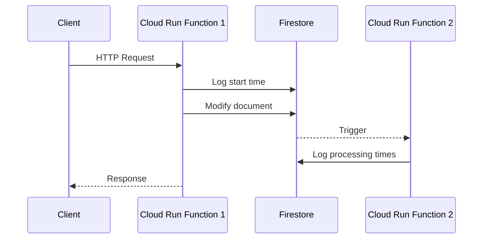

# Cloud Run Functions with Firestore Trigger Latency Test

This project demonstrates a solution for measuring end-to-end latency between two Cloud Run functions, where the first function modifies a Firestore collection and triggers the second function.

## Architecture



## Components

1. **First Cloud Run Function (`firstFunction.js`)**
   - HTTP endpoint that modifies a document in Firestore
   - Logs timing information at start and end
   - Includes request correlation ID for tracking

2. **Second Cloud Run Function (`secondFunction.js`)**
   - Triggered by Firestore document changes
   - Processes the change and logs timing information
   - Calculates total end-to-end latency

3. **Timing Collection**
   - Stores timestamps for each step of the process
   - Enables latency analysis and monitoring
   - Correlates events using request IDs

## Setup

1. Set up Google Cloud project and enable necessary APIs:
   - Cloud Run API
   - Cloud Functions API
   - Firestore API

2. Set up Firebase project and initialize Firestore

3. Set up service account credentials:
   ```bash
   export GOOGLE_APPLICATION_CREDENTIALS="path/to/service-account-key.json"
   ```

## Running Locally

Start the first function (runs on port 8080):
```bash
npm run start-first
```

In another terminal, start the second function (runs on port 8081):
```bash
npm run start-second
```

## Testing

Make a request to the first function:
```bash
curl -X POST http://localhost:8080
```

Note: The functions run on different ports to avoid conflicts:
- First function: http://localhost:8080
- Second function: http://localhost:8081

Check the timing collection in Firestore to see the latency measurements.

## Testing in Production

After deploying the functions to Cloud Run, you can use the provided test script to verify the end-to-end flow and measure latencies:

1. Install the test script dependencies:
```bash
npm install node-fetch
```

2. Ensure you have the service account credentials set up:
```bash
export GOOGLE_APPLICATION_CREDENTIALS="path/to/service-account-key.json"
```

3. Run the test script with your deployed first function URL:
```bash
node test/test-functions.js https://first-function-xxx.run.app
```

The test script will:
- Make a request to the first function
- Monitor the Firestore timing collection in real-time
- Display detailed timing information including:
  * First function execution time
  * Trigger latency
  * Second function execution time
  * Total end-to-end duration
  * Event trigger details

Example output:
```
Starting test...
Making request to first function with requestId: 1708675123456

Current timing data:
First Function Start: 2024-02-23T07:58:43.456Z
First Function End: 2024-02-23T07:58:43.789Z
First Function Duration: 333 ms
Second Function Start: 2024-02-23T07:58:44.123Z
Trigger Latency: 334 ms
Second Function End: 2024-02-23T07:58:44.456Z
Second Function Duration: 333 ms
Total Duration: 1000 ms

Trigger Details:
Event Type: google.cloud.firestore.document.v1.written
Event Time: 2024-02-23T07:58:43.999Z
Document Path: projects/your-project/databases/(default)/documents/items/1708675123456
```

## Deployment

The deployment process involves two main steps:
1. Deploying both Cloud Run functions
2. Setting up the Eventarc trigger for Firestore events

### Using Cloud Build

The included `cloudbuild.yaml` handles the complete deployment:

```bash
# Set your project ID
PROJECT_ID=your-project-id

# Submit the build
gcloud builds submit --project=$PROJECT_ID \
  --substitutions=_REGION=us-central1

# Or specify a different region and service account
gcloud builds submit --project=$PROJECT_ID \
  --substitutions=_REGION=us-central1,_SERVICE_ACCOUNT=your-service-account@your-project.iam.gserviceaccount.com
```

### Manual Deployment

1. Deploy the first function (HTTP trigger):
```bash
gcloud run deploy first-function \
  --source=. \
  --function=modifyDocument \
  --allow-unauthenticated \
  --region=us-central1
```

2. Deploy the second function:
```bash
gcloud run deploy second-function \
  --source=. \
  --function=onItemChange \
  --region=us-central1
```

3. Create the Eventarc trigger for Firestore:
```bash
 gcloud eventarc triggers create firestore-trigger \
       --location=nam5 \
       --destination-run-service=second-function \
       --destination-run-region=us-central1 \
       --event-filters="type=google.cloud.firestore.document.v1.written" \
       --event-filters="database=(default)" \
       --event-filters="namespace=(default)" \
       --event-filters-path-pattern="document=items/**" \
       --event-data-content-type="application/protobuf" \
       --service-account=abc@abc.iam.gserviceaccount.com
```

### Required IAM Permissions

Ensure your service account has the following roles:
- `roles/run.invoker` - For invoking Cloud Run services
- `roles/eventarc.eventReceiver` - For receiving Eventarc events
- `roles/datastore.user` - For Firestore access

### Important Notes

1. Local Testing Limitations:
   - The `@google-cloud/functions-framework` is used for local HTTP testing
   - Firestore triggers only work in deployed environment through Eventarc
   - Local development focuses on function logic testing

2. Production Considerations:
   - Set up proper monitoring for both functions
   - Configure appropriate scaling limits
   - Implement retry policies for failed operations

## Timing Data Structure

The timing collection stores documents with the following structure:
```javascript
{
  requestId: string,
  firstFunctionStart: timestamp,
  firstFunctionEnd: timestamp,
  secondFunctionStart: timestamp,
  secondFunctionEnd: timestamp,
  totalDuration: number // milliseconds
}
```

## Latency Measurement Details

1. When the first function receives a request:
   - Generates a unique requestId
   - Records start timestamp
   - Creates timing document
   - Modifies target document
   - Records completion timestamp

2. When the second function is triggered:
   - Records start timestamp
   - Processes the change
   - Records end timestamp
   - Calculates total duration from initial request

This provides a complete picture of:
- First function processing time
- Trigger latency
- Second function processing time
- Total end-to-end duration
